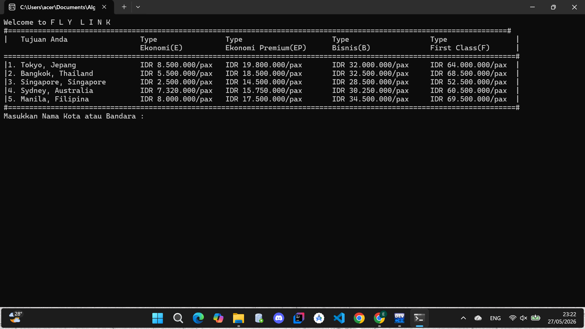

# 💻 Academic Archive: Kumpulan Tugas & Logika Algoritma (T.A. 2022)

Repositori ini berfungsi sebagai dokumentasi dan rekam jejak akademis (*academic archive*) yang berisi kumpulan tugas pemrograman, latihan logika, proyek kecil, dan implementasi struktur data dasar yang saya selesaikan selama menempuh mata kuliah Algoritma dan Pemrograman pada tahun 2022 di program studi Teknik Perangkat Lunak, Universitas Universal.

### 📸 Tampilan Hasil Eksekusi Program (Screenshot)
<p align="center">
  
</p>

### 📌 Tujuan Repositori
Repositori ini disusun secara rapi sebagai pembuktian transparansi proses belajar (*learning journey*) dalam memahami fondasi dasar pemrograman, logika komputasi, dan pemecahan masalah (*problem-solving*) sejak awal masa perkuliahan.

### 💻 Cakupan Materi & Implementasi Kode
Di dalam repositori ini terdapat beberapa implementasi logika dasar rekayasa perangkat lunak, meliputi:
* **Dasar Pemrograman:** Pemahaman variabel, tipe data, operasi aritmatika, dan operasi kondisi tingkat lanjut (`If-Else` / `Switch-Case`).
* **Perulangan (Looping):** Implementasi kontrol struktur `For`, `While`, dan `Do-While` untuk efisiensi eksekusi logika iteratif.
* **Struktur Data Dasar:** Penggunaan dan manipulasi data di dalam Array (baik 1-Dimensi maupun Multi-Dimensi).
* **Fungsi & Prosedur:** Penerapan modularisasi kode melalui fungsi buatan sendiri untuk mendukung penulisan program yang bersih dan modular (*clean code*).

### 🛠️ Tech Stack & Alat Praktikum
* **Bahasa Pemrograman Utama:** C++ Native 
* **Compiler Pendukung:** g++ Compiler / GCC MinGW
* **IDE & Teks Editor:** Dev-C++ / Visual Studio Code

### 🚀 Cara Menjalankan Project secara Lokal

#### Pilihan 1: Menggunakan Command Line (Terminal/CMD)
1. Pastikan komputer Anda telah terinstal compiler C++ (seperti MinGW untuk Windows).
2. Clone repositori ini ke penyimpanan lokal komputer Anda:
   ```bash
   git clone [https://github.com/GHedi/Algo22.git](https://github.com/GHedi/Algo22.git)
